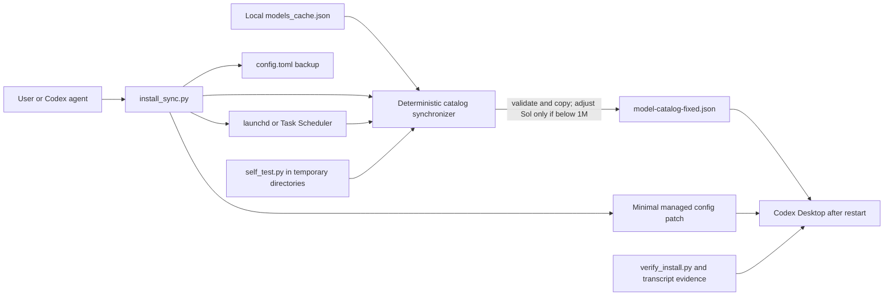

# Enable Codex 1M Context

A portable Codex skill that repairs a locally observed GPT-5.6 Sol model-catalog mismatch in Codex Desktop on macOS and Windows.

> [!IMPORTANT]
> This is an independent, temporary compatibility workaround, not an official OpenAI package. OpenAI currently documents GPT-5.6 Sol with a 1,050,000-token API context window. This skill does not increase the model's server-side capability or bypass account, workspace, product, or rate limits; it only keeps a local Codex model catalog and related configuration consistent when Desktop reports a lower value.

## Why this exists

Codex Desktop can occasionally retain a local `models_cache.json` entry whose Sol context metadata is lower than the currently expected value. A one-time manual edit is fragile: the cache can refresh, the app loads catalogs at startup, and a malformed replacement can break model discovery.

This skill turns that repair into a deterministic, reversible workflow. It copies the current local catalog, changes only `gpt-5.6-sol.max_context_window` when the value is below 1,000,000, preserves all other model fields, and verifies the installed state.

## Problems solved

- Replaces repeated hand-editing after model-cache refreshes.
- Rejects missing, malformed, or duplicate Sol entries without replacing the last known good output.
- Keeps macOS and Windows setup behavior aligned.
- Backs up and minimally patches only the managed top-level Codex configuration keys.
- Provides strict status checks and a conservative uninstall path.

## Capabilities

- Dry-run installation before any persistent change.
- Atomic fixed-catalog generation from the official local `models_cache.json`.
- Preservation of a cloud value at or above 1,000,000.
- Automatic resynchronization with `launchd` on macOS or Task Scheduler on Windows.
- Manual synchronization for users who choose `--no-schedule`.
- Strict installation verification with machine-readable JSON output.
- Safe uninstall that restores only values still matching installer-managed settings.
- Isolated self-tests that do not touch the real Codex home.

## Architecture and how it works



All model-catalog processing is local. The scheduler is a non-AI operating-system trigger that reruns the bundled synchronizer.

## Requirements

- macOS or Windows
- Codex Desktop with a local `models_cache.json`
- Python 3.9 or newer
- A supported scheduler unless installing with `--no-schedule`

## Installation

Download the release ZIP, extract it, and install the directory as a Codex skill named `enable-codex-1m-context`. Ask Codex to use `$enable-codex-1m-context`, or invoke the scripts directly from the extracted skill directory.

Always inspect a dry run first:

```bash
python3 scripts/install_sync.py --dry-run
python3 scripts/install_sync.py
```

To avoid scheduler installation and synchronize manually:

```bash
python3 scripts/install_sync.py --no-schedule
python3 scripts/sync_catalog.py
```

The scripts resolve Codex home in this order: `--codex-home`, `CODEX_HOME`, then the current user's `.codex` directory.

## Usage workflow

1. Run the installer dry run and review the reported paths and scheduler.
2. Run the installer.
3. Fully quit and reopen Codex Desktop because the model catalog is loaded at startup.
4. Select GPT-5.6 Sol, send a short message, and wait for a completed reply.
5. Run `python3 scripts/verify_install.py --strict`.
6. For runtime acceptance, pair the same session's Sol model record with its reported effective context window; configuration evidence alone is insufficient.

At an `effective_context_window_percent` of 95, a fixed maximum of 1,000,000 is expected to produce an effective runtime window near 950,000 rather than a literal one million.

## Completely uninstall

Only run removal when that is the intended action:

```bash
python3 scripts/uninstall_sync.py --remove-skill
```

The uninstaller removes the scheduler, generated catalog, and stable runtime directory. It restores only configuration keys that still match installer-managed values, leaves user-modified values untouched, writes a pre-uninstall backup, and requires an app restart.

## Boundaries and limitations

- The tool is a local compatibility workaround, not an OpenAI service or official Codex feature.
- It does not call OpenAI APIs, private model-catalog endpoints, or authentication files.
- It does not change account entitlements, rate limits, pricing, or server-side model behavior.
- It targets only `gpt-5.6-sol` and refuses ambiguous or malformed source data.
- It cannot hot-update an already running Codex task; restart and same-session runtime evidence are required.
- Support is tested through simulated macOS and Windows paths. A real Windows scheduler installation was not performed in the v1.0.1 release verification.
- Remove the workaround when Codex Desktop consistently supplies suitable official catalog metadata for the user's environment.

## Privacy, data, and network behavior

The bundled Python code reads local Codex model metadata and managed configuration files. It writes a fixed local catalog, backups, status/install-state JSON, scheduler definitions, and optional local logs. It contains no telemetry and makes no network requests. Normal Codex Desktop operation and downloading this release remain subject to their own network behavior.

## Verification

Run the isolated test suite:

```bash
python3 scripts/self_test.py
python3 -m compileall -q scripts
```

Release v1.0.1 was verified on macOS with Python 3 by running seven isolated unit/integration tests covering catalog preservation, invalid-source rollback, configuration restoration, scheduler payloads, Windows path escaping, and dry runs for both supported platforms. The tests use temporary directories and do not touch the operator's real Codex home.

## Release variants

The GitHub Release contains one portable skill ZIP plus a generated SHA-256 manifest. There is no connected or telemetry-enabled variant.

## License and help

Licensed under the [MIT License](LICENSE). Report reproducible problems through this repository's GitHub Issues page. Include the platform, Python version, command, sanitized JSON output, and whether a scheduler was enabled; never include authentication files or tokens.

## Official reference

OpenAI's current GPT-5.6 Sol model page documents the model's API context window and may change independently of Codex Desktop's local catalog behavior: <https://developers.openai.com/api/docs/models/gpt-5.6-sol>.
