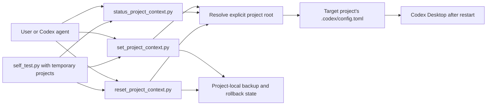

# Codex Project Context

A portable Codex skill for setting, inspecting, switching, and safely resetting GPT-5.6 Sol context limits for one trusted project at a time.

The GitHub repository keeps the historical slug `enable-codex-1m-context` for release continuity. The skill itself is named `codex-project-context`; v2.1.0 is the project-scoped successor to the repository's v1.0.1 global catalog workaround.

> [!IMPORTANT]
> This is an independent Codex skill, not an official OpenAI package. It changes only the target project's `.codex/config.toml`. It never edits `~/.codex/config.toml`, reads `models_cache.json`, installs a scheduler, or claims to hot-update a running task.

## Why this exists

Different Codex projects can need different context budgets. A global setting makes unrelated projects inherit the same model and compaction behavior, while manual edits are easy to repeat incorrectly or apply to the wrong directory. This skill provides an explicit, reversible project-local control surface for values from 64k through 1m.

The intended outcome is a trusted project whose context setting is visible, reproducible, and easy to roll back without changing global Codex defaults.

## Problems solved

- Prevents an ambiguous current-directory edit from changing the wrong project.
- Avoids global configuration changes when only one project needs a different context budget.
- Preserves unrelated TOML settings and comments while managing exactly three top-level keys.
- Rejects unsafe roots, invalid token values, duplicate managed keys, and invalid compaction thresholds.
- Keeps rollback state inside the same project and preserves later user edits during reset.

## Capabilities

- Set or switch a project to values such as `258k`, `600k`, or `1m`.
- Choose an explicit automatic-compaction threshold or default to 90% of the context window.
- Run a dry-run plan before writing.
- Inspect status with strict static checks and JSON output.
- Reset only the skill-managed values to their recorded pre-change state.
- Maintain timestamped project-local backups and rollback state.
- Run isolated tests without touching the operator's real Codex home or a target project.

## Architecture and how it works



The scripts manage only the target project's top-level `model`, `model_context_window`, and `model_auto_compact_token_limit` assignments. The project must still be trusted for Codex to load its `.codex/` layer.

## Requirements

- macOS or Windows
- Python 3.9 or newer
- A target project directory that is neither the filesystem root nor the user's home directory
- A trusted project in Codex Desktop for the project-level override to take effect

## Installation

Download the v2.1.0 ZIP, extract it, and install the enclosed `codex-project-context` directory as a Codex skill. The scripts can also be invoked directly from that directory.

Verify the package without changing any real project:

```bash
python3 scripts/self_test.py
```

## Usage workflow

Always pass the absolute target project root. Preview a change first when the scope needs review:

```bash
python3 scripts/set_project_context.py \
  --project-root "/absolute/path/to/project" \
  --context 600k \
  --dry-run
```

Apply a 1m project override with 900k automatic compaction:

```bash
python3 scripts/set_project_context.py \
  --project-root "/absolute/path/to/project" \
  --context 1m \
  --auto-compact 900k
```

Inspect the project-local state without changing it:

```bash
python3 scripts/status_project_context.py \
  --project-root "/absolute/path/to/project" \
  --strict
```

After setting or switching:

1. Fully restart Codex Desktop.
2. Reopen the same existing conversation in the trusted target project.
3. Confirm that the active model is `gpt-5.6-sol` and that runtime evidence matches the configured budget.

The setting is not a hot per-thread update. Increasing a window also cannot reconstruct detail that was already lost during an earlier compaction.

## Reset

Preview a rollback:

```bash
python3 scripts/reset_project_context.py \
  --project-root "/absolute/path/to/project" \
  --dry-run
```

Apply it only when removal is intended:

```bash
python3 scripts/reset_project_context.py \
  --project-root "/absolute/path/to/project"
```

Reset restores only keys that still match the most recent managed values. If a user changed a managed key afterward, it is preserved and reported. Backups remain inside the target project's `.codex/codex-project-context-backups/` directory.

## Boundaries and limitations

- Scope is one explicit project; global Codex defaults are intentionally out of scope.
- The skill does not read or modify authentication data, global Codex configuration, model catalogs, or scheduler state.
- It does not change account entitlements, server-side model behavior, rate limits, or pricing.
- A project must be trusted by Codex Desktop; the scripts cannot grant that trust.
- Configuration evidence alone does not prove runtime activation; restart and same-conversation verification are required.
- The package is tested with simulated project paths on macOS. A real Windows Codex Desktop runtime was not executed for v2.1.0.

## Privacy, data, and network behavior

All bundled operations are local and make no network requests or telemetry calls. The scripts read and write only the explicitly supplied project's `.codex/config.toml`, project-local backups, and rollback-state JSON. They do not inspect `~/.codex`, credentials, or model caches. Normal Codex Desktop behavior and downloading this release have their own network behavior.

## Verification

Run the package tests and compile check:

```bash
python3 scripts/self_test.py
python3 -m compileall -q scripts
```

v2.1.0 was verified with six isolated tests covering project-root safety, preservation of unrelated TOML, safe reset after user edits, absence of global-config references, set/status/reset behavior, and token parsing/bounds. The tests use temporary project directories.

## Release variants

The GitHub Release contains one portable skill ZIP and a generated SHA-256 manifest. There is no connected, telemetry-enabled, scheduler, or global-catalog variant.

## License and help

Licensed under the repository's [MIT License](LICENSE). Report reproducible issues on [GitHub Issues](https://github.com/yimengbenxin/enable-codex-1m-context/issues) with the platform, Python version, exact command, sanitized JSON output, and whether the project is trusted. Do not attach credentials or private configuration files.
